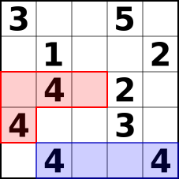

Fillomino
=========

概要
----

フィルオミノ（fillomino）は、ルールに従って盤面を数字で埋めるペンシルパズルの一つである。
ルールは以下のとおりである。

1.  盤面のすべてのマスに数字を入れる。
2.  同じ数字はその数字に等しい個数だけつながる。
3.  つながった同じ数字は、別の同じ数字のつながったものと辺を共有しない。

これをCSPソルバーで解くことを考えてみる。

例題
----

以下は５ｘ５の例である。

数字のあるマスについて、その数字の数だけ縦横にマスを覆うようにする。

このとき、数字を共有するような覆い方は許される。

各数字ごとに変数を定義すると、このような共有する場合が問題となる。
そこで、各変数の値は全く同一（つまり領域を完全に共有）であってもよいこととする。
各変数間の制約は以下のいずれかであるとする。

1.  同一の値である。（サイズと要素の座標値が一致）
2.  重なりがない。かつ同一のサイズの場合は隣り合っていないこと。

以下の図において
赤い領域は３つの４で共有されている。
青い領域は単独の４で構成されている。
赤と青は重なりがないが、同一サイズで隣り合っているため、
制約を満たさない。

以下では赤と青はそれぞれ２つずつの４で共有され、
重なりもなく、同一サイズではあるが隣り合ってはいないため、
制約を満たしている。

解法
----

1.  各数字ごとに変数を持つ。
2.  変数のドメイン要素はPointSetとする。
3.  各数字を含むサイズが数字に等しいPointSetの集合を初期ドメインとする。
4.  PointSetは同一数字であれば通ってもよい。異なる数字は通ってはいけない。
5.  各PointSetのサイズと同じ数字が隣接していてはいけない。